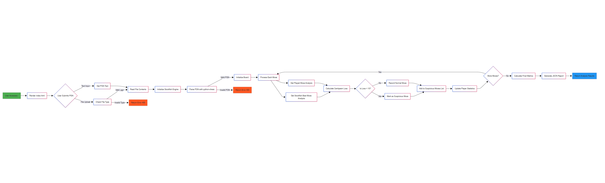
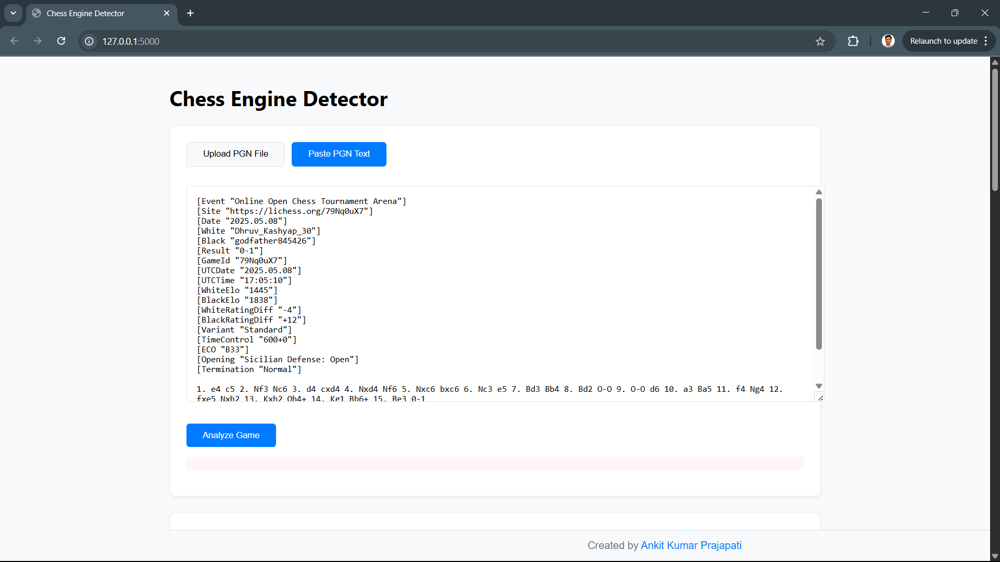
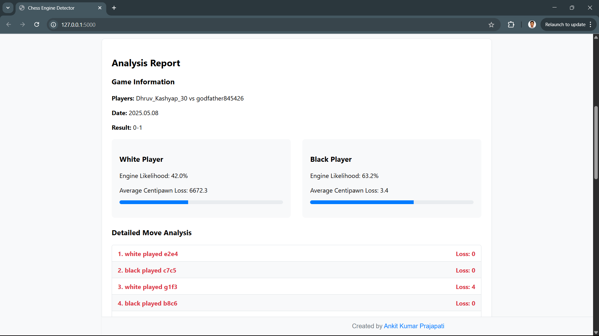

# Chess Cheat Detector


A web application that analyzes chess games (PGN format) to detect potential engine assistance using Stockfish.

[Report Bug](https://github.com/AKPrajapati9211/chess-cheat-detector/issues)

## Features

- PGN file upload and text input
- Engine likelihood percentage calculation
- Centipawn loss analysis
- Suspicious move detection
- Interactive results visualization
- Responsive web interface

## Workflow Diagram



## Screenshots




## Setup

### Prerequisites
- Python 3.8+
- Stockfish engine

### Installation

1. Clone the repository:

    ```bash
    git clone https://github.com/AKPrajapati9211/chess-cheat-detector.git
    cd chess-cheat-detector

2. Install dependencies:

    ```bash
    pip install -r requirements.txt

3. Download Stockfish:

- Visit stockfishchess.org

- Extract the executable to /stockfish folder

### Configuration
Update Stockfish path in app.py:

    STOCKFISH_PATH = os.path.join(
        os.path.dirname(__file__), 
        "stockfish", 
        "stockfish-windows-x86-64-avx2.exe"  
    )
### Usage
- Running Locally

    ```bash
    python app.py
- Visit http://localhost:5000 in your browser

### Contributing
Contributions are welcome! Please follow these steps:

- Fork the project

- Create your feature branch (git checkout -b feature/AmazingFeature)

- Commit your changes (git commit -m 'Add some AmazingFeature')

- Push to the branch (git push origin feature/AmazingFeature)

- Open a Pull Request
